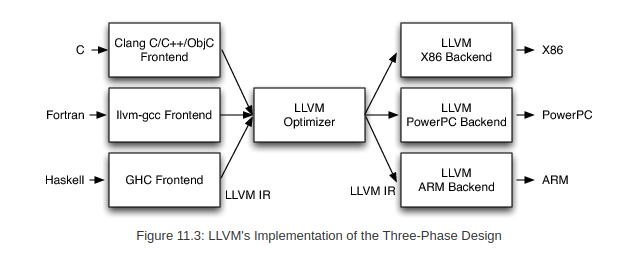

# Pascal_Compiler

## 1. Scanner

### 1.1 一些约定

* Pascal Reserved Words

| DIV       | MOD       | OR         | AND       | NOT     | ARRAY      | PROGRAM  | PROCEDURE | FUNCTION | CONST      |
| --------- | --------- | ---------- | --------- | ------- | ---------- | -------- | --------- | -------- | ---------- |
| **TYPE**  | **OF**    | **RECORD** | **BEGIN** | **END** | **VAR**    | **IF**   | **THEN**  | **ELSE** | **REPEAT** |
| **UNTIL** | **WHILE** | **DO**     | **FOR**   | **TO**  | **DOWNTO** | **CASE** | **GOTO**  |          |            |


* Pascal符号

| .    | ..   | ;    | ,    | :    | (    | )    |
| ---- | ---- | ---- | ---- | ---- | ---- | ---- |
|[     | ]    | =    | <>   | \>=  | >    | <=   |
|	<    | +    | -    | *    | /    | %    | :=   |

* Pascal基本类型

INTEGER, REAL, CHAR, STRING , BOOLEAN 


* Pascal字面量

整数，浮点数，字符，字符串，布尔字面量 (true, false)


* Identifier

Pascal 的 Identifier 是以字母或下划线开头，后接若干字母、数字与下划线的字符串


* Pascal注释

约定"{"和"}"标识了注释的开始于结束

### 1.2 Scanner实现

#### A. Pascal保留字和符号

对于Pascal保留字和符号，我们直接返回对应的token，如下代码所示

```cpp
"."             {return DOT;}
".."            {return DOTDOT;}
";"             {return SEMI;}
"ARRAY"         {return ARRAY;}
"PROGRAM"       {return PROGRAM;}
"PROCEDURE"     {return PROCEDURE;}
```


#### B. Pascal基本类型

对于Pascal基本类型，我们首先设置yylval.astTypeKind， 然后返回的token为SYS_TYPE

```cpp
"BOOLEAN"   {yylval.astTypeKind = ast::TypeKind::BOOLEANtype; return SYS_TYPE; }
"CHAR"      {yylval.astTypeKind = ast::TypeKind::CHARtype; return SYS_TYPE; }
"INTEGER"   {yylval.astTypeKind = ast::TypeKind::INTtype; return SYS_TYPE; }
"REAL"      {yylval.astTypeKind = ast::TypeKind::REALtype; return SYS_TYPE; }
"STRING"    {yylval.astTypeKind = ast::TypeKind::STRINGtype; return SYS_TYPE; }

```

#### C. Pascal字面量

对于Pascal字面量，我们首先根据yytext里面的内容设置对应的yylval，然后返回对应类型的token

```cpp
{number} 			{yylval.astint = atoi(yytext); return INTEGER;}
\'.\'    			{yylval.astchar = yytext[1]; return CHAR;}
'([^']|'')+'  		{yylval.aststring = strdup(yytext); return STRING;}
[0-9]+"."[0-9]+  	{yylval.astreal = atof(yytext); return REAL;}
```


#### D. identifier

根据我们对identifier的约定，给出正则表达式`[a-zA-Z_]([_a-zA-Z0-9])* `

匹配到identifer后，首先将yytext的内容复制到yylval的string类型中，然后返回token ID.

```cpp
[a-zA-Z_]([_a-zA-Z0-9])*     {yylval.aststring = strdup(yytext); return ID;}
```


#### E. Pascal注释

每次读到"{"后，就一直读入后续字符，直到读到"}", 结束注释

```cpp
"{"             {   
                    char c;
                    do { 
                        c = yyinput();
                        if (c == EOF) break;
                        if (c == '\n') lineno++;
                    } while (c != '}');
                }
```


## 2. Parser

### 2.1 文法分析

首先给出文法如下


### 2.1 语法树节点定义

根据文法规则，我们设计了语法树结构


<table>
   <tr>
      <td>基类</td>
      <td></td>
      <td>BasicAstNode</td>
      <td>所有节点的基类</td>
   </tr>
   <tr>
      <td></td>
      <td></td>
      <td>Expression</td>
      <td>所有表达式的基类</td>
   </tr>
   <tr>
      <td></td>
      <td></td>
      <td>BasicConst</td>
      <td>所有字面量的基类</td>
   </tr>
   <tr>
      <td></td>
      <td></td>
      <td>BasicType</td>
      <td>所有类型的基类</td>
   </tr>
   <tr>
      <td></td>
      <td></td>
      <td>BasicStmt</td>
      <td>所有语句的基类</td>
   </tr>
   <tr>
      <td>Expression</td>
      <td></td>
      <td>BinaryExpr</td>
      <td>二元表达式</td>
   </tr>
   <tr>
      <td></td>
      <td></td>
      <td>UnaryExpr</td>
      <td>一元表达式</td>
   </tr>
   <tr>
      <td>ID</td>
      <td></td>
      <td>Identifier</td>
      <td>identifier(内容可修改)</td>
   </tr>
   <tr>
      <td></td>
      <td></td>
      <td>Name</td>
      <td>name(内容不可修改)</td>
   </tr>
   <tr>
      <td>program</td>
      <td></td>
      <td>Program</td>
      <td>语法树的根节点</td>
   </tr>
   <tr>
      <td></td>
      <td></td>
      <td>ProgramHead</td>
      <td>程序头</td>
   </tr>
   <tr>
      <td></td>
      <td></td>
      <td>Routine</td>
      <td>子程序</td>
   </tr>
   <tr>
      <td></td>
      <td></td>
      <td>RoutineHead</td>
      <td>子程序头</td>
   </tr>
   <tr>
      <td>program head</td>
      <td></td>
      <td>Parameter</td>
      <td>函数/过程参数</td>
   </tr>
   <tr>
      <td>routine head</td>
      <td></td>
      <td>ConstDecl</td>
      <td>const定义</td>
   </tr>
   <tr>
      <td></td>
      <td></td>
      <td>TypeDecl</td>
      <td>类型定义</td>
   </tr>
   <tr>
      <td></td>
      <td></td>
      <td>VarDecl</td>
      <td>变量定义</td>
   </tr>
   <tr>
      <td>const value</td>
      <td></td>
      <td>IntegerNode</td>
      <td>integer类型字面量</td>
   </tr>
   <tr>
      <td></td>
      <td></td>
      <td>RealNode</td>
      <td>real类型字面量</td>
   </tr>
   <tr>
      <td></td>
      <td></td>
      <td>CharNode</td>
      <td>char类型字面量</td>
   </tr>
   <tr>
      <td></td>
      <td></td>
      <td>StringNode</td>
      <td>string类型字面量</td>
   </tr>
   <tr>
      <td></td>
      <td></td>
      <td>BooleanNode</td>
      <td>boolean类型字面量</td>
   </tr>
   <tr>
      <td></td>
      <td></td>
      <td>MaxIntNode</td>
      <td>maxint字面量</td>
   </tr>
   <tr>
      <td>Type</td>
      <td>type</td>
      <td>SimpleType</td>
      <td>SimpleType基类</td>
   </tr>
   <tr>
      <td></td>
      <td></td>
      <td>ArrayType</td>
      <td>数组类型</td>
   </tr>
   <tr>
      <td></td>
      <td></td>
      <td>RecordType</td>
      <td>Record类型</td>
   </tr>
   <tr>
      <td></td>
      <td></td>
      <td>UserDefType</td>
      <td>用户定义类型</td>
   </tr>
   <tr>
      <td></td>
      <td>SimpleType</td>
      <td>CharType</td>
      <td>char类型</td>
   </tr>
   <tr>
      <td></td>
      <td></td>
      <td>IntegerType</td>
      <td>integer类型</td>
   </tr>
   <tr>
      <td></td>
      <td></td>
      <td>RealType</td>
      <td>real类型</td>
   </tr>
   <tr>
      <td></td>
      <td></td>
      <td>StringType</td>
      <td>string类型</td>
   </tr>
   <tr>
      <td></td>
      <td></td>
      <td>BooleanType</td>
      <td>boolean类型</td>
   </tr>
   <tr>
      <td></td>
      <td></td>
      <td>RangeType</td>
      <td>range类型</td>
   </tr>
   <tr>
      <td></td>
      <td></td>
      <td>VoidType</td>
      <td>void类型</td>
   </tr>
   <tr>
      <td>Statement</td>
      <td>statement</td>
      <td>AssignStmt</td>
      <td>赋值语句</td>
   </tr>
   <tr>
      <td></td>
      <td></td>
      <td>ProcCallStmt</td>
      <td>过程/函数调用语句</td>
   </tr>
   <tr>
      <td></td>
      <td></td>
      <td>IfStmt</td>
      <td>if语句</td>
   </tr>
   <tr>
      <td></td>
      <td></td>
      <td>RepeatStmt</td>
      <td>repeat语句</td>
   </tr>
   <tr>
      <td></td>
      <td></td>
      <td>WhileStmt</td>
      <td>while语句</td>
   </tr>
   <tr>
      <td></td>
      <td></td>
      <td>ForStmt</td>
      <td>for语句</td>
   </tr>
   <tr>
      <td></td>
      <td></td>
      <td>CaseStmt</td>
      <td>case语句</td>
   </tr>
   <tr>
      <td></td>
      <td></td>
      <td>CaseExpr</td>
      <td>case中的条件选择语句</td>
   </tr>
   <tr>
      <td></td>
      <td></td>
      <td>GotoStmt</td>
      <td>goto语句</td>
   </tr>
   <tr>
      <td></td>
      <td></td>
      <td>LabelStmt</td>
      <td>带label语句</td>
   </tr>
   <tr>
      <td></td>
      <td></td>
      <td>StmtList</td>
      <td>语句集合</td>
   </tr>
   <tr>
      <td></td>
      <td>proc/func call</td>
      <td>SysProcCall</td>
      <td>调用系统过程</td>
   </tr>
   <tr>
      <td></td>
      <td></td>
      <td>SysFuncCall</td>
      <td>调用系统函数</td>
   </tr>
   <tr>
      <td></td>
      <td></td>
      <td>UserDefProcCall</td>
      <td>调用用户定义函数/过程</td>
   </tr>
</table>


### 2.3 Parser实现


#### A. Expression 部分

```cpp
expression      :  expression  GE  expr {
                    $$ = new ast::BinaryExpr($1, ast::BinaryOperator::GEop, $3);
                } 
                |  ...(略去)
                |  expr {
                    $$ = $1;
                }
;
expr            :  expr  PLUS  term  {
                    $$ = new ast::BinaryExpr($1, ast::BinaryOperator::PLUSop, $3);
                } 
                | ...(略去)
                |  term {
                    $$ = $1;
                }
;

term            :  term  MUL  factor {
                    $$ = new ast::BinaryExpr($1, ast::BinaryOperator::MULop, $3);
                }  
                | ...(略去)
                }
;

factor          :  NAME {
                    $$ = new ast::Name($1);
                }
                |  NAME  LP  args_list  RP  {
                    $$ = new ast::UserDefProcCall(new ast::Name($1), $3);
                }
                |  SYS_FUNCT {
                    $$ = new ast::SysFuncCall($1);
                }
                |  SYS_FUNCT  LP  args_list  RP  {
                    $$ = new ast::SysFuncCall($1, $3);
                }
                |  const_value  {
                    $$ = $1;
                }
                |  LP  expression  RP {
                    $$ = $2;
                }
                |  NOT  factor  {
                    $$ = new ast::UnaryExpr(ast::UnaryOperator::NOTop, $2);
                }
                |  MINUS  factor {
                    $$ = new ast::UnaryExpr(ast::UnaryOperator::NEGop, $2);
                }
                |  ID  LB  expression  RB {
                    $$ = new ast::ArrayElementRef(new ast::Identifier($1), $3);
                }
                |  ID  DOT  ID {
                    $$ = new ast::RecordElementRef(new ast::Identifier($1), new ast::Identifier($3));
                }
;
```


#### B. Statement部分

```cpp
stmt_list       : stmt_list  stmt  SEMI {
                    $$ = $1;
                    for(auto s : *($2))
                        $$->push_back(s);
                }
                |  {
                    $$ = new ast::StmtList();
                }
;
```

```cpp
stmt            : assign_stmt {
                    $$ = new ast::StmtList();
                    $$->push_back((ast::Stmt*)$1);
                }
                | proc_stmt {
                    $$ = new ast::StmtList();
                    $$->push_back((ast::Stmt*)$1);
                }
                | ...(略去)
;
```

**Assign**语句

```cpp
assign_stmt     : ID  ASSIGN  expression {
                    $$ = new ast::AssignStmt(new ast::Identifier($1), $3);
                }
                | ID LB expression RB ASSIGN expression {
                    $$ = new ast::AssignStmt(new ast::ArrayElementRef(new ast::Identifier($1), $3), $6);
                }
                | ID  DOT  ID  ASSIGN  expression {
                    $$ = new ast::AssignStmt(new ast::RecordElementRef(new ast::Identifier($1), new ast::Identifier($3)), $5);
                }
;
```

其他语句同理

#### C. Type

```cpp
type_decl_list  : type_decl_list  type_definition { 
                    $$ = $1;
                    $1->push_back($2);
                }
                |  type_definition {
                    $$ = new ast::TypeDeclList();
                    $$->push_back($1);
                }
;

type_definition : NAME  EQUAL  type_decl  SEMI { 
                    $$ = new ast::TypeDecl(new ast::Name($1), $3); 
                }
;

type_decl       : simple_type_decl  { $$ = $1; }
                | array_type_decl   { $$ = $1; }
                | record_type_decl  { $$ = $1; }
;

simple_type_decl: SYS_TYPE { 
                    if($1 == ast::TypeKind::INTtype) {
                        $$ = new ast::IntegerType();
                    } else if($1 == ast::TypeKind::REALtype) {
                        $$ = new ast::RealType();
                    } else if($1 == ast::TypeKind::CHARtype) {
                        $$ = new ast::CharType();
                    } else if($1 == ast::TypeKind::BOOLEANtype) {
                        $$ = new ast::BooleanType();
                    } else if($1 == ast::TypeKind::STRINGtype) {
                        $$ = new ast::StringType();
                    }
                } 
                |  NAME  {
                    $$ = new ast::UserDefType(new ast::Name($1));
                }
                |  const_value  DOTDOT  const_value { 
                    $$ = new ast::RangeType($1, $3); 
                }
                |  MINUS  const_value  DOTDOT  const_value { 
                    $$ = new ast::RangeType(new ast::UnaryExpr(ast::UnaryOperator::NEGop, $2), $4); 
                }
                |  MINUS  const_value  DOTDOT  MINUS  const_value { 
                    $$ = new ast::RangeType(new ast::UnaryExpr(ast::UnaryOperator::NEGop, $2), new ast::UnaryExpr(ast::UnaryOperator::NEGop, $5)); 
                }
                |  NAME  DOTDOT  NAME {
                    $$ = new ast::RangeType(new ast::Name($1), new ast::Name($3));
                }
;


array_type_decl : ARRAY  LB  simple_type_decl  RB  OF  type_decl { 
                    $$ = new ast::ArrayType($3, $6); 
                }
;

record_type_decl: RECORD  field_decl_list  END { 
                    $$ = new ast::RecordType($2); 
                }
;
```

#### D. 字面量

```cpp
const_value     :  INTEGER          {$$ = new ast::IntegerNode($1);}
                |  MINUS INTEGER    {$$ = new ast::IntegerNode(-$2);}
                |  REAL             {$$ = new ast::RealNode($1);}
                |  MINUS REAL       {$$ = new ast::RealNode(-$2);}
                |  CHAR             {$$ = new ast::CharNode($1);}
                |  STRING           {$$ = new ast::StringNode($1);}
                |  BOOLEAN          {$$ = new ast::BooleanNode($1);}
                |  SYS_CON          {$$ = new ast::MaxIntNode();}
;
```


### 2.4 测试

#### A. Test Expression

pascal代码

```pascal
PROGRAM ex;
VAR A : INTEGER;
    B : INTEGER;
    C : REAL;
    D : INTEGER;
    E : BOOLEAN;
BEGIN
    A := 100;
    A := A / 3; 
    A := A + 20;
    A := A * 4;
    A := -A;
    C := 10.0;
    C := A + 20.0;
    C := C / 10.0;
    B := A % B;
    D := A OR B;
    D := A AND B;
    D := NOT A;
    E := A = B;
    E := A > B;
    E := A >= B;
    E := A < B;
    E := A <= B;   
END.
```

输出语法树结构如下

```
Program
|---ProgramHead
|   |---Identifier:ex
|   |---VOID
|---Routine
|   |---RoutineHead
|   |   |---VarDecl
|   |   |   |---Identifier:A
|   |   |   |---Integer
|   |   |---VarDecl
|   |   |   |---Identifier:B
|   |   |   |---Integer
|   |   |---VarDecl
|   |   |   |---Identifier:C
|   |   |   |---Real
|   |   |---VarDecl
|   |   |   |---Identifier:D
|   |   |   |---Integer
|   |   |---VarDecl
|   |   |   |---Identifier:E
|   |   |   |---Boolean
|   |---AssignStmt
|   |   |---Identifier:A
|   |   |---IntegerNode: 100
|   |---AssignStmt
|   |   |---Identifier:A
|   |   |---BinaryExpr:/
|   |   |   |---Name:A
|   |   |   |---IntegerNode: 3
|   |---AssignStmt
|   |   |---Identifier:A
|   |   |---BinaryExpr:+
|   |   |   |---Name:A
|   |   |   |---IntegerNode: 20
|   |---AssignStmt
|   |   |---Identifier:A
|   |   |---BinaryExpr:*
|   |   |   |---Name:A
|   |   |   |---IntegerNode: 4
|   |---AssignStmt
|   |   |---Identifier:A
|   |   |---UnaryExpr:-
|   |   |   |---Name:A
|   |---AssignStmt
|   |   |---Identifier:C
|   |   |---ReadNode: 10
|   |---AssignStmt
|   |   |---Identifier:C
|   |   |---BinaryExpr:+
|   |   |   |---Name:A
|   |   |   |---ReadNode: 20
|   |---AssignStmt
|   |   |---Identifier:C
|   |   |---BinaryExpr:/
|   |   |   |---Name:C
|   |   |   |---ReadNode: 10
|   |---AssignStmt
|   |   |---Identifier:B
|   |   |---BinaryExpr:%
|   |   |   |---Name:A
|   |   |   |---Name:B
|   |---AssignStmt
|   |   |---Identifier:D
|   |   |---BinaryExpr:OR
|   |   |   |---Name:A
|   |   |   |---Name:B
|   |---AssignStmt
|   |   |---Identifier:D
|   |   |---BinaryExpr:AND
|   |   |   |---Name:A
|   |   |   |---Name:B
|   |---AssignStmt
|   |   |---Identifier:D
|   |   |---UnaryExpr:NOT
|   |   |   |---Name:A
|   |---AssignStmt
|   |   |---Identifier:E
|   |   |---BinaryExpr:=
|   |   |   |---Name:A
|   |   |   |---Name:B
|   |---AssignStmt
|   |   |---Identifier:E
|   |   |---BinaryExpr:>
|   |   |   |---Name:A
|   |   |   |---Name:B
|   |---AssignStmt
|   |   |---Identifier:E
|   |   |---BinaryExpr:>=
|   |   |   |---Name:A
|   |   |   |---Name:B
|   |---AssignStmt
|   |   |---Identifier:E
|   |   |---BinaryExpr:<
|   |   |   |---Name:A
|   |   |   |---Name:B
|   |---AssignStmt
|   |   |---Identifier:E
|   |   |---BinaryExpr:<=
|   |   |   |---Name:A
|   |   |   |---Name:B
```


#### B. Test Statement 

pascal代码

```pascal
PROGRAM stmtTest;
CONST
    a = 1;
VAR
    b, c, d : INTEGER;

BEGIN
    b := 1;
    c := 0;
    1: IF a = 1 THEN BEGIN
        FOR d:=1 TO 10 DO BEGIN 
            c := c + 1;
            WHILE C <= 5 DO BEGIN 
                d := 0;
                d := 0;
            END;

            REPEAT 
                d := 0;
            UNTIL C > 5;
        END;
    END  
    ELSE 
    BEGIN 
        d := 0;
    END;
    
    CASE d + 1 OF 
		0: BEGIN str := 'A1'; c := 1; END;
		1: str := 'B2';
		2: str := 'C3';
		3: str := 'D4';
	END;

    GOTO 1;
    WRITE(d);
    WRITELN(d);
END.
```

输出语法树结构

```
Program
|---ProgramHead
|   |---Identifier:stmtTest
|   |---VOID
|---Routine
|   |---RoutineHead
|   |   |---ConstDecl
|   |   |   |---Name:a
|   |   |   |---IntegerNode: 1
|   |   |---VarDecl
|   |   |   |---Identifier:b
|   |   |   |---Integer
|   |   |---VarDecl
|   |   |   |---Identifier:c
|   |   |   |---Integer
|   |   |---VarDecl
|   |   |   |---Identifier:d
|   |   |   |---Integer
|   |---AssignStmt
|   |   |---Identifier:b
|   |   |---IntegerNode: 1
|   |---AssignStmt
|   |   |---Identifier:c
|   |   |---IntegerNode: 0
|   |---LabelStmt: 1
|   |   |---IfStmt
|   |   |   |---BinaryExpr:=
|   |   |   |   |---Name:a
|   |   |   |   |---IntegerNode: 1
|   |   |   |---StmtList
|   |   |   |   |---ForStmt
|   |   |   |   |   |---Identifier:d
|   |   |   |   |   |---IntegerNode: 1
|   |   |   |   |   |---IntegerNode: 10
|   |   |   |   |   |---StmtList
|   |   |   |   |   |   |---AssignStmt
|   |   |   |   |   |   |   |---Identifier:c
|   |   |   |   |   |   |   |---BinaryExpr:+
|   |   |   |   |   |   |   |   |---Name:c
|   |   |   |   |   |   |   |   |---IntegerNode: 1
|   |   |   |   |   |   |---WhileStmt
|   |   |   |   |   |   |   |---BinaryExpr:<=
|   |   |   |   |   |   |   |   |---Name:C
|   |   |   |   |   |   |   |   |---IntegerNode: 5
|   |   |   |   |   |   |   |---StmtList
|   |   |   |   |   |   |   |   |---AssignStmt
|   |   |   |   |   |   |   |   |   |---Identifier:d
|   |   |   |   |   |   |   |   |   |---IntegerNode: 0
|   |   |   |   |   |   |   |   |---AssignStmt
|   |   |   |   |   |   |   |   |   |---Identifier:d
|   |   |   |   |   |   |   |   |   |---IntegerNode: 0
|   |   |   |   |   |   |---RepeatStmt
|   |   |   |   |   |   |   |---BinaryExpr:>
|   |   |   |   |   |   |   |   |---Name:C
|   |   |   |   |   |   |   |   |---IntegerNode: 5
|   |   |   |   |   |   |   |---AssignStmt
|   |   |   |   |   |   |   |   |---Identifier:d
|   |   |   |   |   |   |   |   |---IntegerNode: 0
|   |   |   |---StmtList
|   |   |   |   |---AssignStmt
|   |   |   |   |   |---Identifier:d
|   |   |   |   |   |---IntegerNode: 0
|   |---CaseStmt
|   |   |---BinaryExpr:+
|   |   |   |---Name:d
|   |   |   |---IntegerNode: 1
|   |   |---CaseExpr
|   |   |   |---IntegerNode: 0
|   |   |   |---StmtList
|   |   |   |   |---AssignStmt
|   |   |   |   |   |---Identifier:str
|   |   |   |   |   |---StringNode: 'A1'
|   |   |   |   |---AssignStmt
|   |   |   |   |   |---Identifier:c
|   |   |   |   |   |---IntegerNode: 1
|   |   |---CaseExpr
|   |   |   |---IntegerNode: 1
|   |   |   |---AssignStmt
|   |   |   |   |---Identifier:str
|   |   |   |   |---StringNode: 'B2'
|   |   |---CaseExpr
|   |   |   |---IntegerNode: 2
|   |   |   |---AssignStmt
|   |   |   |   |---Identifier:str
|   |   |   |   |---StringNode: 'C3'
|   |   |---CaseExpr
|   |   |   |---IntegerNode: 3
|   |   |   |---AssignStmt
|   |   |   |   |---Identifier:str
|   |   |   |   |---StringNode: 'D4'
|   |---GOTO: 1
|   |---SysProcCall: WRITE
|   |   |---Name:d
|   |---SysProcCall: WRITELN
|   |   |---Name:d
```

#### C. Type Test

pascal代码

```pascal
PROGRAM arrayRecord;
CONST
    a = FALSE;
    b = 10;
    c = 2.2;
    d = 't';
TYPE
    test = INTEGER;
    rtype = RECORD
        a : INTEGER;
        b,c : REAL;
    END;

VAR
    f : test;
    h : STRING;
    i : BOOLEAN;
    j : ARRAY [0..3] OF INTEGER;
    k : rtype;

BEGIN
    f := 1;
    h := 'string';
    i := FALSE;
    j[0] := 0 + 1 + 2;
    e := j[0] + j[1] * j[2];
    k.a := j[0] + b - c * 4 DIV 3 * 3;
    k.b := 1.3;
END.
```

输出语法树

```
Program
|---ProgramHead
|   |---Identifier:arrayRecord
|   |---VOID
|---Routine
|   |---RoutineHead
|   |   |---ConstDecl
|   |   |   |---Name:a
|   |   |   |---BooleanNode: 0
|   |   |---ConstDecl
|   |   |   |---Name:b
|   |   |   |---IntegerNode: 10
|   |   |---ConstDecl
|   |   |   |---Name:c
|   |   |   |---ReadNode: 2.2
|   |   |---ConstDecl
|   |   |   |---Name:d
|   |   |   |---CharNode: t
|   |   |---TypeDecl
|   |   |   |---Name:test
|   |   |   |---Integer
|   |   |---TypeDecl
|   |   |   |---Name:rtype
|   |   |   |---Record
|   |   |   |   |---VarDecl
|   |   |   |   |   |---Identifier:a
|   |   |   |   |   |---Integer
|   |   |   |   |---VarDecl
|   |   |   |   |   |---Identifier:b
|   |   |   |   |   |---Real
|   |   |   |   |---VarDecl
|   |   |   |   |   |---Identifier:c
|   |   |   |   |   |---Real
|   |   |---VarDecl
|   |   |   |---Identifier:f
|   |   |   |---UserDefType: test
|   |   |---VarDecl
|   |   |   |---Identifier:h
|   |   |   |---String
|   |   |---VarDecl
|   |   |   |---Identifier:i
|   |   |   |---Boolean
|   |   |---VarDecl
|   |   |   |---Identifier:j
|   |   |   |---Array
|   |   |   |   |---Range
|   |   |   |   |   |---IntegerNode: 0
|   |   |   |   |   |---IntegerNode: 3
|   |   |   |   |---Integer
|   |   |---VarDecl
|   |   |   |---Identifier:k
|   |   |   |---UserDefType: rtype
|   |---AssignStmt
|   |   |---Identifier:f
|   |   |---IntegerNode: 1
|   |---AssignStmt
|   |   |---Identifier:h
|   |   |---StringNode: 'string'
|   |---AssignStmt
|   |   |---Identifier:i
|   |   |---BooleanNode: 0
|   |---AssignStmt
|   |   |---ArrayElementRef
|   |   |   |---Identifier:j
|   |   |   |---IntegerNode: 0
|   |   |---BinaryExpr:+
|   |   |   |---BinaryExpr:+
|   |   |   |   |---IntegerNode: 0
|   |   |   |   |---IntegerNode: 1
|   |   |   |---IntegerNode: 2
|   |---AssignStmt
|   |   |---Identifier:e
|   |   |---BinaryExpr:+
|   |   |   |---ArrayElementRef
|   |   |   |   |---Identifier:j
|   |   |   |   |---IntegerNode: 0
|   |   |   |---BinaryExpr:*
|   |   |   |   |---ArrayElementRef
|   |   |   |   |   |---Identifier:j
|   |   |   |   |   |---IntegerNode: 1
|   |   |   |   |---ArrayElementRef
|   |   |   |   |   |---Identifier:j
|   |   |   |   |   |---IntegerNode: 2
|   |---AssignStmt
|   |   |---RecordElementRef
|   |   |   |---Identifier:k
|   |   |   |---Identifier:a
|   |   |---BinaryExpr:-
|   |   |   |---BinaryExpr:+
|   |   |   |   |---ArrayElementRef
|   |   |   |   |   |---Identifier:j
|   |   |   |   |   |---IntegerNode: 0
|   |   |   |   |---Name:b
|   |   |   |---BinaryExpr:*
|   |   |   |   |---BinaryExpr:/
|   |   |   |   |   |---BinaryExpr:*
|   |   |   |   |   |   |---Name:c
|   |   |   |   |   |   |---IntegerNode: 4
|   |   |   |   |   |---IntegerNode: 3
|   |   |   |   |---IntegerNode: 3
|   |---AssignStmt
|   |   |---RecordElementRef
|   |   |   |---Identifier:k
|   |   |   |---Identifier:b
|   |   |---ReadNode: 1.3
```

#### D. Test Proc/Func 

pascal代码

```pascal
PROGRAM procTest;
{routine head}

{const part}
CONST
	cn = 2;
	dn = 123.23;
{var part}
VAR	
	k : INTEGER;

{routine part}
PROCEDURE outer;
{subroutine var part}
VAR 
	res : INTEGER;
	added : INTEGER;
{subroutine routine part}
FUNCTION inner1(a , b : INTEGER) : INTEGER;
BEGIN
	inner1 := a + b;
END;

PROCEDURE inner2(aa : INTEGER; b :INTEGER);
BEGIN
	aa := inner1(aa , b);
	k := k + 10;
END;

BEGIN
	k := 0;
	inner2(k , 10);
END;

{routine body}
BEGIN
	outer;
END.
```

输出语法树

```
Program
|---ProgramHead
|   |---Identifier:procTest
|   |---VOID
|---Routine
|   |---RoutineHead
|   |   |---ConstDecl
|   |   |   |---Name:cn
|   |   |   |---IntegerNode: 2
|   |   |---ConstDecl
|   |   |   |---Name:dn
|   |   |   |---ReadNode: 123.23
|   |   |---VarDecl
|   |   |   |---Identifier:k
|   |   |   |---Integer
|   |   |---Program
|   |   |   |---ProgramHead
|   |   |   |   |---Identifier:outer
|   |   |   |   |---VOID
|   |   |   |---Routine
|   |   |   |   |---RoutineHead
|   |   |   |   |   |---VarDecl
|   |   |   |   |   |   |---Identifier:res
|   |   |   |   |   |   |---Integer
|   |   |   |   |   |---VarDecl
|   |   |   |   |   |   |---Identifier:added
|   |   |   |   |   |   |---Integer
|   |   |   |   |   |---Program
|   |   |   |   |   |   |---ProgramHead
|   |   |   |   |   |   |   |---Identifier:inner1
|   |   |   |   |   |   |   |---Parameter
|   |   |   |   |   |   |   |   |---Identifier:a
|   |   |   |   |   |   |   |   |---Integer
|   |   |   |   |   |   |   |---Parameter
|   |   |   |   |   |   |   |   |---Identifier:b
|   |   |   |   |   |   |   |   |---Integer
|   |   |   |   |   |   |   |---Integer
|   |   |   |   |   |   |---Routine
|   |   |   |   |   |   |   |---RoutineHead
|   |   |   |   |   |   |   |---AssignStmt
|   |   |   |   |   |   |   |   |---Identifier:inner1
|   |   |   |   |   |   |   |   |---BinaryExpr:+
|   |   |   |   |   |   |   |   |   |---Name:a
|   |   |   |   |   |   |   |   |   |---Name:b
|   |   |   |   |   |---Program
|   |   |   |   |   |   |---ProgramHead
|   |   |   |   |   |   |   |---Identifier:inner2
|   |   |   |   |   |   |   |---Parameter
|   |   |   |   |   |   |   |   |---Identifier:aa
|   |   |   |   |   |   |   |   |---Integer
|   |   |   |   |   |   |   |---Parameter
|   |   |   |   |   |   |   |   |---Identifier:b
|   |   |   |   |   |   |   |   |---Integer
|   |   |   |   |   |   |   |---VOID
|   |   |   |   |   |   |---Routine
|   |   |   |   |   |   |   |---RoutineHead
|   |   |   |   |   |   |   |---AssignStmt
|   |   |   |   |   |   |   |   |---Identifier:aa
|   |   |   |   |   |   |   |   |---UserDefProcCall: inner1
|   |   |   |   |   |   |   |   |   |---Name:aa
|   |   |   |   |   |   |   |   |   |---Name:b
|   |   |   |   |   |   |   |---AssignStmt
|   |   |   |   |   |   |   |   |---Identifier:k
|   |   |   |   |   |   |   |   |---BinaryExpr:+
|   |   |   |   |   |   |   |   |   |---Name:k
|   |   |   |   |   |   |   |   |   |---IntegerNode: 10
|   |   |   |   |---AssignStmt
|   |   |   |   |   |---Identifier:k
|   |   |   |   |   |---IntegerNode: 0
|   |   |   |   |---UserDefProcCall: inner2
|   |   |   |   |   |---Name:k
|   |   |   |   |   |---IntegerNode: 10
|   |---UserDefProcCall: outer
```


# 代码生成

使用了LLVM库，将 AST 转化为 LLVM IR 中间代码。

为了实现 AST 到中间代码的转换，需要维护一个运行环境，维护当前的变量，函数等信息。


## LLVM

LLVM 的核心设计了一个叫 **LLVM IR** 的中间代码， 并以 **库(Library)** 的方式提供一系列接口， 提供生成、操作IR，生成目标平台代码等功能。



LLVM IR 有三种不同的形式：内存中的编译中间语言（IR），保存在硬盘上的 bitcode（`.bc` 文件，适合快速地被一个 JIT 编译器加载），一个可读性的汇编语言表示 (`.ll` 文件)。LLVM项目提供不同代码之间的相互转换。

从  AST 到 LLVM IR 的部分主要使用了 <llvm/IR/...> 中的内容，简单介绍如下

### Module

LLVM 程序由 Module 组成，每个程序模块都是输入程序的翻译单元。每个模块由函数，全局变量和符号表条目组成。

在项目中，实现对简单单文件程序的编译，我们创建一个 Module 完成整个编译工作。

首先在 Module 中创建函数，再往函数中放入表达式的 IR，最后将所有的 IR 输出。

### Function

LLVM 中的函数指针主要有两个部分：函数类型和函数体

函数类型主要表示函数的输入和输出，可以使用 FunctionType 类型

函数体由 BasicBlock 构成，通过 Builder往 BasicBlock 中加入 IR

### BasicBlock

IR是一种抽象的汇编语言，它使用有条件和无条件的跳转（称为分支）来表示控制流。分支之间的依次运行的代码序列称为 BasicBlock，或简称为块。

### IRBuilder

用于创建指令并将其附加到块末尾的便捷接口，其中提供了多种不同的指令

### Value

value 类用来 LLVM 中的表示具有类型的值。在表达式代码生成时通过传递 value 表示变量。


## 环境维护

/gen/...

代码生成中的环境维护主要分为几个方面：

实现中通过在函数定义和函数调用等不同部分间接地实现 access link 和 control link 

### 变量信息维护

变量维护通过一个栈实现，栈的每一层都是一个 map，map中用变量名对应一个 llvm::Value

当进入函数定义时，往栈中加入一层，出现变量申明时往 map 中新建 Value；查找变量时从栈顶往下依层查询，从而得到变量正确的引用。离开函数定义时，压入栈的层出栈。实现了 access link 的功能。

对于全局变量，则是用 llvm::Module 中的全局变量定义。


### 函数信息维护

函数信息维护与变量信息相似。

出现函数调用时，搜索函数信息的栈，通过得到的 llvm::Function 指针调用函数。

直接通过 llvm 中的调用操作即可转换为中间代码。函数调用一般都用过命令跳转实现，即没有内联函数。通过 LLVM 可以完成调用完函数后返回原 Basiclock，从而无需实现 control link。

在搜索函数时，若栈中无法得到，则会搜索系统函数。

