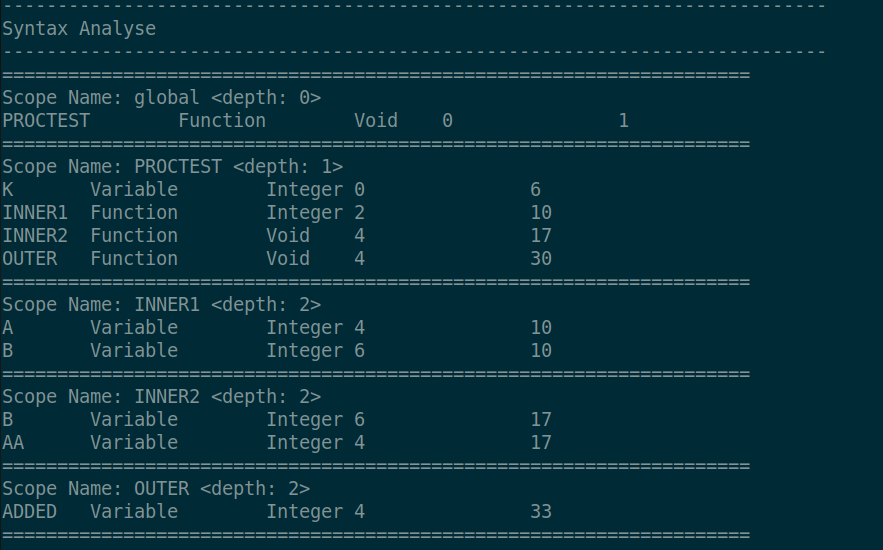

# Pascal_Compiler

## 1. Scanner

### 1.1 一些约定

* Pascal Reserved Words

| DIV       | MOD       | OR         | AND       | NOT     | ARRAY      | PROGRAM  | PROCEDURE | FUNCTION | CONST      |
| --------- | --------- | ---------- | --------- | ------- | ---------- | -------- | --------- | -------- | ---------- |
| **TYPE**  | **OF**    | **RECORD** | **BEGIN** | **END** | **VAR**    | **IF**   | **THEN**  | **ELSE** | **REPEAT** |
| **UNTIL** | **WHILE** | **DO**     | **FOR**   | **TO**  | **DOWNTO** | **CASE** | **GOTO**  |          |            |


* Pascal符号

| .    | ..   | ;    | ,    | :    | (    | )    |
| ---- | ---- | ---- | ---- | ---- | ---- | ---- |
|[     | ]    | =    | <>   | \>=  | >    | <=   |
|	<    | +    | -    | *    | /    | %    | :=   |

* Pascal基本类型

INTEGER, REAL, CHAR, STRING , BOOLEAN 


* Pascal字面量

整数，浮点数，字符，字符串，布尔字面量 (true, false)


* Identifier

Pascal 的 Identifier 是以字母或下划线开头，后接若干字母、数字与下划线的字符串


* Pascal注释

约定"{"和"}"标识了注释的开始于结束

### 1.2 Scanner实现

#### A. Pascal保留字和符号

对于Pascal保留字和符号，我们直接返回对应的token，如下代码所示

```cpp
"."             {return DOT;}
".."            {return DOTDOT;}
";"             {return SEMI;}
"ARRAY"         {return ARRAY;}
"PROGRAM"       {return PROGRAM;}
"PROCEDURE"     {return PROCEDURE;}
```


#### B. Pascal基本类型

对于Pascal基本类型，我们首先设置yylval.astTypeKind， 然后返回的token为SYS_TYPE

```cpp
"BOOLEAN"   {yylval.astTypeKind = ast::TypeKind::BOOLEANtype; return SYS_TYPE; }
"CHAR"      {yylval.astTypeKind = ast::TypeKind::CHARtype; return SYS_TYPE; }
"INTEGER"   {yylval.astTypeKind = ast::TypeKind::INTtype; return SYS_TYPE; }
"REAL"      {yylval.astTypeKind = ast::TypeKind::REALtype; return SYS_TYPE; }
"STRING"    {yylval.astTypeKind = ast::TypeKind::STRINGtype; return SYS_TYPE; }

```

#### C. Pascal字面量

对于Pascal字面量，我们首先根据yytext里面的内容设置对应的yylval，然后返回对应类型的token

```cpp
{number} 			{yylval.astint = atoi(yytext); return INTEGER;}
\'.\'    			{yylval.astchar = yytext[1]; return CHAR;}
'([^']|'')+'  		{yylval.aststring = strdup(yytext); return STRING;}
[0-9]+"."[0-9]+  	{yylval.astreal = atof(yytext); return REAL;}
```


#### D. identifier

根据我们对identifier的约定，给出正则表达式`[a-zA-Z_]([_a-zA-Z0-9])* `

匹配到identifer后，首先将yytext的内容复制到yylval的string类型中，然后返回token ID.

```cpp
[a-zA-Z_]([_a-zA-Z0-9])*     {yylval.aststring = strdup(yytext); return ID;}
```


#### E. Pascal注释

每次读到"{"后，就一直读入后续字符，直到读到"}", 结束注释

```cpp
"{"             {   
                    char c;
                    do { 
                        c = yyinput();
                        if (c == EOF) break;
                        if (c == '\n') lineno++;
                    } while (c != '}');
                }
```


## 2. Parser

### 2.1 文法分析

首先给出文法如下


### 2.1 语法树节点定义

根据文法规则，我们设计了语法树结构


<table>
   <tr>
      <td>基类</td>
      <td></td>
      <td>BasicAstNode</td>
      <td>所有节点的基类</td>
   </tr>
   <tr>
      <td></td>
      <td></td>
      <td>Expression</td>
      <td>所有表达式的基类</td>
   </tr>
   <tr>
      <td></td>
      <td></td>
      <td>BasicConst</td>
      <td>所有字面量的基类</td>
   </tr>
   <tr>
      <td></td>
      <td></td>
      <td>BasicType</td>
      <td>所有类型的基类</td>
   </tr>
   <tr>
      <td></td>
      <td></td>
      <td>BasicStmt</td>
      <td>所有语句的基类</td>
   </tr>
   <tr>
      <td>Expression</td>
      <td></td>
      <td>BinaryExpr</td>
      <td>二元表达式</td>
   </tr>
   <tr>
      <td></td>
      <td></td>
      <td>UnaryExpr</td>
      <td>一元表达式</td>
   </tr>
   <tr>
      <td>ID</td>
      <td></td>
      <td>Identifier</td>
      <td>identifier(内容可修改)</td>
   </tr>
   <tr>
      <td></td>
      <td></td>
      <td>Name</td>
      <td>name(内容不可修改)</td>
   </tr>
   <tr>
      <td>program</td>
      <td></td>
      <td>Program</td>
      <td>语法树的根节点</td>
   </tr>
   <tr>
      <td></td>
      <td></td>
      <td>ProgramHead</td>
      <td>程序头</td>
   </tr>
   <tr>
      <td></td>
      <td></td>
      <td>Routine</td>
      <td>子程序</td>
   </tr>
   <tr>
      <td></td>
      <td></td>
      <td>RoutineHead</td>
      <td>子程序头</td>
   </tr>
   <tr>
      <td>program head</td>
      <td></td>
      <td>Parameter</td>
      <td>函数/过程参数</td>
   </tr>
   <tr>
      <td>routine head</td>
      <td></td>
      <td>ConstDecl</td>
      <td>const定义</td>
   </tr>
   <tr>
      <td></td>
      <td></td>
      <td>TypeDecl</td>
      <td>类型定义</td>
   </tr>
   <tr>
      <td></td>
      <td></td>
      <td>VarDecl</td>
      <td>变量定义</td>
   </tr>
   <tr>
      <td>const value</td>
      <td></td>
      <td>IntegerNode</td>
      <td>integer类型字面量</td>
   </tr>
   <tr>
      <td></td>
      <td></td>
      <td>RealNode</td>
      <td>real类型字面量</td>
   </tr>
   <tr>
      <td></td>
      <td></td>
      <td>CharNode</td>
      <td>char类型字面量</td>
   </tr>
   <tr>
      <td></td>
      <td></td>
      <td>StringNode</td>
      <td>string类型字面量</td>
   </tr>
   <tr>
      <td></td>
      <td></td>
      <td>BooleanNode</td>
      <td>boolean类型字面量</td>
   </tr>
   <tr>
      <td></td>
      <td></td>
      <td>MaxIntNode</td>
      <td>maxint字面量</td>
   </tr>
   <tr>
      <td>Type</td>
      <td>type</td>
      <td>SimpleType</td>
      <td>SimpleType基类</td>
   </tr>
   <tr>
      <td></td>
      <td></td>
      <td>ArrayType</td>
      <td>数组类型</td>
   </tr>
   <tr>
      <td></td>
      <td></td>
      <td>RecordType</td>
      <td>Record类型</td>
   </tr>
   <tr>
      <td></td>
      <td></td>
      <td>UserDefType</td>
      <td>用户定义类型</td>
   </tr>
   <tr>
      <td></td>
      <td>SimpleType</td>
      <td>CharType</td>
      <td>char类型</td>
   </tr>
   <tr>
      <td></td>
      <td></td>
      <td>IntegerType</td>
      <td>integer类型</td>
   </tr>
   <tr>
      <td></td>
      <td></td>
      <td>RealType</td>
      <td>real类型</td>
   </tr>
   <tr>
      <td></td>
      <td></td>
      <td>StringType</td>
      <td>string类型</td>
   </tr>
   <tr>
      <td></td>
      <td></td>
      <td>BooleanType</td>
      <td>boolean类型</td>
   </tr>
   <tr>
      <td></td>
      <td></td>
      <td>RangeType</td>
      <td>range类型</td>
   </tr>
   <tr>
      <td></td>
      <td></td>
      <td>VoidType</td>
      <td>void类型</td>
   </tr>
   <tr>
      <td>Statement</td>
      <td>statement</td>
      <td>AssignStmt</td>
      <td>赋值语句</td>
   </tr>
   <tr>
      <td></td>
      <td></td>
      <td>ProcCallStmt</td>
      <td>过程/函数调用语句</td>
   </tr>
   <tr>
      <td></td>
      <td></td>
      <td>IfStmt</td>
      <td>if语句</td>
   </tr>
   <tr>
      <td></td>
      <td></td>
      <td>RepeatStmt</td>
      <td>repeat语句</td>
   </tr>
   <tr>
      <td></td>
      <td></td>
      <td>WhileStmt</td>
      <td>while语句</td>
   </tr>
   <tr>
      <td></td>
      <td></td>
      <td>ForStmt</td>
      <td>for语句</td>
   </tr>
   <tr>
      <td></td>
      <td></td>
      <td>CaseStmt</td>
      <td>case语句</td>
   </tr>
   <tr>
      <td></td>
      <td></td>
      <td>CaseExpr</td>
      <td>case中的条件选择语句</td>
   </tr>
   <tr>
      <td></td>
      <td></td>
      <td>GotoStmt</td>
      <td>goto语句</td>
   </tr>
   <tr>
      <td></td>
      <td></td>
      <td>LabelStmt</td>
      <td>带label语句</td>
   </tr>
   <tr>
      <td></td>
      <td></td>
      <td>StmtList</td>
      <td>语句集合</td>
   </tr>
   <tr>
      <td></td>
      <td>proc/func call</td>
      <td>SysProcCall</td>
      <td>调用系统过程</td>
   </tr>
   <tr>
      <td></td>
      <td></td>
      <td>SysFuncCall</td>
      <td>调用系统函数</td>
   </tr>
   <tr>
      <td></td>
      <td></td>
      <td>UserDefProcCall</td>
      <td>调用用户定义函数/过程</td>
   </tr>
</table>


### 2.3 Parser实现


#### A. Expression 部分

```cpp
expression      :  expression  GE  expr {
                    $$ = new ast::BinaryExpr($1, ast::BinaryOperator::GEop, $3);
                } 
                |  ...(略去)
                |  expr {
                    $$ = $1;
                }
;
expr            :  expr  PLUS  term  {
                    $$ = new ast::BinaryExpr($1, ast::BinaryOperator::PLUSop, $3);
                } 
                | ...(略去)
                |  term {
                    $$ = $1;
                }
;

term            :  term  MUL  factor {
                    $$ = new ast::BinaryExpr($1, ast::BinaryOperator::MULop, $3);
                }  
                | ...(略去)
                }
;

factor          :  NAME {
                    $$ = new ast::Name($1);
                }
                |  NAME  LP  args_list  RP  {
                    $$ = new ast::UserDefProcCall(new ast::Name($1), $3);
                }
                |  SYS_FUNCT {
                    $$ = new ast::SysFuncCall($1);
                }
                |  SYS_FUNCT  LP  args_list  RP  {
                    $$ = new ast::SysFuncCall($1, $3);
                }
                |  const_value  {
                    $$ = $1;
                }
                |  LP  expression  RP {
                    $$ = $2;
                }
                |  NOT  factor  {
                    $$ = new ast::UnaryExpr(ast::UnaryOperator::NOTop, $2);
                }
                |  MINUS  factor {
                    $$ = new ast::UnaryExpr(ast::UnaryOperator::NEGop, $2);
                }
                |  ID  LB  expression  RB {
                    $$ = new ast::ArrayElementRef(new ast::Identifier($1), $3);
                }
                |  ID  DOT  ID {
                    $$ = new ast::RecordElementRef(new ast::Identifier($1), new ast::Identifier($3));
                }
;
```


#### B. Statement部分

```cpp
stmt_list       : stmt_list  stmt  SEMI {
                    $$ = $1;
                    for(auto s : *($2))
                        $$->push_back(s);
                }
                |  {
                    $$ = new ast::StmtList();
                }
;
```

```cpp
stmt            : assign_stmt {
                    $$ = new ast::StmtList();
                    $$->push_back((ast::Stmt*)$1);
                }
                | proc_stmt {
                    $$ = new ast::StmtList();
                    $$->push_back((ast::Stmt*)$1);
                }
                | ...(略去)
;
```

**Assign**语句

```cpp
assign_stmt     : ID  ASSIGN  expression {
                    $$ = new ast::AssignStmt(new ast::Identifier($1), $3);
                }
                | ID LB expression RB ASSIGN expression {
                    $$ = new ast::AssignStmt(new ast::ArrayElementRef(new ast::Identifier($1), $3), $6);
                }
                | ID  DOT  ID  ASSIGN  expression {
                    $$ = new ast::AssignStmt(new ast::RecordElementRef(new ast::Identifier($1), new ast::Identifier($3)), $5);
                }
;
```

其他语句同理

#### C. Type

```cpp
type_decl_list  : type_decl_list  type_definition { 
                    $$ = $1;
                    $1->push_back($2);
                }
                |  type_definition {
                    $$ = new ast::TypeDeclList();
                    $$->push_back($1);
                }
;

type_definition : NAME  EQUAL  type_decl  SEMI { 
                    $$ = new ast::TypeDecl(new ast::Name($1), $3); 
                }
;

type_decl       : simple_type_decl  { $$ = $1; }
                | array_type_decl   { $$ = $1; }
                | record_type_decl  { $$ = $1; }
;

simple_type_decl: SYS_TYPE { 
                    if($1 == ast::TypeKind::INTtype) {
                        $$ = new ast::IntegerType();
                    } else if($1 == ast::TypeKind::REALtype) {
                        $$ = new ast::RealType();
                    } else if($1 == ast::TypeKind::CHARtype) {
                        $$ = new ast::CharType();
                    } else if($1 == ast::TypeKind::BOOLEANtype) {
                        $$ = new ast::BooleanType();
                    } else if($1 == ast::TypeKind::STRINGtype) {
                        $$ = new ast::StringType();
                    }
                } 
                |  NAME  {
                    $$ = new ast::UserDefType(new ast::Name($1));
                }
                |  const_value  DOTDOT  const_value { 
                    $$ = new ast::RangeType($1, $3); 
                }
                |  MINUS  const_value  DOTDOT  const_value { 
                    $$ = new ast::RangeType(new ast::UnaryExpr(ast::UnaryOperator::NEGop, $2), $4); 
                }
                |  MINUS  const_value  DOTDOT  MINUS  const_value { 
                    $$ = new ast::RangeType(new ast::UnaryExpr(ast::UnaryOperator::NEGop, $2), new ast::UnaryExpr(ast::UnaryOperator::NEGop, $5)); 
                }
                |  NAME  DOTDOT  NAME {
                    $$ = new ast::RangeType(new ast::Name($1), new ast::Name($3));
                }
;


array_type_decl : ARRAY  LB  simple_type_decl  RB  OF  type_decl { 
                    $$ = new ast::ArrayType($3, $6); 
                }
;

record_type_decl: RECORD  field_decl_list  END { 
                    $$ = new ast::RecordType($2); 
                }
;
```

#### D. 字面量

```cpp
const_value     :  INTEGER          {$$ = new ast::IntegerNode($1);}
                |  MINUS INTEGER    {$$ = new ast::IntegerNode(-$2);}
                |  REAL             {$$ = new ast::RealNode($1);}
                |  MINUS REAL       {$$ = new ast::RealNode(-$2);}
                |  CHAR             {$$ = new ast::CharNode($1);}
                |  STRING           {$$ = new ast::StringNode($1);}
                |  BOOLEAN          {$$ = new ast::BooleanNode($1);}
                |  SYS_CON          {$$ = new ast::MaxIntNode();}
;
```


### 2.4 测试

#### A. Test Expression

pascal代码

```pascal
PROGRAM ex;
VAR A : INTEGER;
    B : INTEGER;
    C : REAL;
    D : INTEGER;
    E : BOOLEAN;
BEGIN
    A := 100;
    A := A / 3; 
    A := A + 20;
    A := A * 4;
    A := -A;
    C := 10.0;
    C := A + 20.0;
    C := C / 10.0;
    B := A % B;
    D := A OR B;
    D := A AND B;
    D := NOT A;
    E := A = B;
    E := A > B;
    E := A >= B;
    E := A < B;
    E := A <= B;   
END.
```

输出语法树结构如下

```
Program
|---ProgramHead
|   |---Identifier:ex
|   |---VOID
|---Routine
|   |---RoutineHead
|   |   |---VarDecl
|   |   |   |---Identifier:A
|   |   |   |---Integer
|   |   |---VarDecl
|   |   |   |---Identifier:B
|   |   |   |---Integer
|   |   |---VarDecl
|   |   |   |---Identifier:C
|   |   |   |---Real
|   |   |---VarDecl
|   |   |   |---Identifier:D
|   |   |   |---Integer
|   |   |---VarDecl
|   |   |   |---Identifier:E
|   |   |   |---Boolean
|   |---AssignStmt
|   |   |---Identifier:A
|   |   |---IntegerNode: 100
|   |---AssignStmt
|   |   |---Identifier:A
|   |   |---BinaryExpr:/
|   |   |   |---Name:A
|   |   |   |---IntegerNode: 3
|   |---AssignStmt
|   |   |---Identifier:A
|   |   |---BinaryExpr:+
|   |   |   |---Name:A
|   |   |   |---IntegerNode: 20
|   |---AssignStmt
|   |   |---Identifier:A
|   |   |---BinaryExpr:*
|   |   |   |---Name:A
|   |   |   |---IntegerNode: 4
|   |---AssignStmt
|   |   |---Identifier:A
|   |   |---UnaryExpr:-
|   |   |   |---Name:A
|   |---AssignStmt
|   |   |---Identifier:C
|   |   |---ReadNode: 10
|   |---AssignStmt
|   |   |---Identifier:C
|   |   |---BinaryExpr:+
|   |   |   |---Name:A
|   |   |   |---ReadNode: 20
|   |---AssignStmt
|   |   |---Identifier:C
|   |   |---BinaryExpr:/
|   |   |   |---Name:C
|   |   |   |---ReadNode: 10
|   |---AssignStmt
|   |   |---Identifier:B
|   |   |---BinaryExpr:%
|   |   |   |---Name:A
|   |   |   |---Name:B
|   |---AssignStmt
|   |   |---Identifier:D
|   |   |---BinaryExpr:OR
|   |   |   |---Name:A
|   |   |   |---Name:B
|   |---AssignStmt
|   |   |---Identifier:D
|   |   |---BinaryExpr:AND
|   |   |   |---Name:A
|   |   |   |---Name:B
|   |---AssignStmt
|   |   |---Identifier:D
|   |   |---UnaryExpr:NOT
|   |   |   |---Name:A
|   |---AssignStmt
|   |   |---Identifier:E
|   |   |---BinaryExpr:=
|   |   |   |---Name:A
|   |   |   |---Name:B
|   |---AssignStmt
|   |   |---Identifier:E
|   |   |---BinaryExpr:>
|   |   |   |---Name:A
|   |   |   |---Name:B
|   |---AssignStmt
|   |   |---Identifier:E
|   |   |---BinaryExpr:>=
|   |   |   |---Name:A
|   |   |   |---Name:B
|   |---AssignStmt
|   |   |---Identifier:E
|   |   |---BinaryExpr:<
|   |   |   |---Name:A
|   |   |   |---Name:B
|   |---AssignStmt
|   |   |---Identifier:E
|   |   |---BinaryExpr:<=
|   |   |   |---Name:A
|   |   |   |---Name:B
```


#### B. Test Statement 

pascal代码

```pascal
PROGRAM stmtTest;
CONST
    a = 1;
VAR
    b, c, d : INTEGER;

BEGIN
    b := 1;
    c := 0;
    1: IF a = 1 THEN BEGIN
        FOR d:=1 TO 10 DO BEGIN 
            c := c + 1;
            WHILE C <= 5 DO BEGIN 
                d := 0;
                d := 0;
            END;

            REPEAT 
                d := 0;
            UNTIL C > 5;
        END;
    END  
    ELSE 
    BEGIN 
        d := 0;
    END;
    
    CASE d + 1 OF 
		0: BEGIN str := 'A1'; c := 1; END;
		1: str := 'B2';
		2: str := 'C3';
		3: str := 'D4';
	END;

    GOTO 1;
    WRITE(d);
    WRITELN(d);
END.
```

输出语法树结构

```
Program
|---ProgramHead
|   |---Identifier:stmtTest
|   |---VOID
|---Routine
|   |---RoutineHead
|   |   |---ConstDecl
|   |   |   |---Name:a
|   |   |   |---IntegerNode: 1
|   |   |---VarDecl
|   |   |   |---Identifier:b
|   |   |   |---Integer
|   |   |---VarDecl
|   |   |   |---Identifier:c
|   |   |   |---Integer
|   |   |---VarDecl
|   |   |   |---Identifier:d
|   |   |   |---Integer
|   |---AssignStmt
|   |   |---Identifier:b
|   |   |---IntegerNode: 1
|   |---AssignStmt
|   |   |---Identifier:c
|   |   |---IntegerNode: 0
|   |---LabelStmt: 1
|   |   |---IfStmt
|   |   |   |---BinaryExpr:=
|   |   |   |   |---Name:a
|   |   |   |   |---IntegerNode: 1
|   |   |   |---StmtList
|   |   |   |   |---ForStmt
|   |   |   |   |   |---Identifier:d
|   |   |   |   |   |---IntegerNode: 1
|   |   |   |   |   |---IntegerNode: 10
|   |   |   |   |   |---StmtList
|   |   |   |   |   |   |---AssignStmt
|   |   |   |   |   |   |   |---Identifier:c
|   |   |   |   |   |   |   |---BinaryExpr:+
|   |   |   |   |   |   |   |   |---Name:c
|   |   |   |   |   |   |   |   |---IntegerNode: 1
|   |   |   |   |   |   |---WhileStmt
|   |   |   |   |   |   |   |---BinaryExpr:<=
|   |   |   |   |   |   |   |   |---Name:C
|   |   |   |   |   |   |   |   |---IntegerNode: 5
|   |   |   |   |   |   |   |---StmtList
|   |   |   |   |   |   |   |   |---AssignStmt
|   |   |   |   |   |   |   |   |   |---Identifier:d
|   |   |   |   |   |   |   |   |   |---IntegerNode: 0
|   |   |   |   |   |   |   |   |---AssignStmt
|   |   |   |   |   |   |   |   |   |---Identifier:d
|   |   |   |   |   |   |   |   |   |---IntegerNode: 0
|   |   |   |   |   |   |---RepeatStmt
|   |   |   |   |   |   |   |---BinaryExpr:>
|   |   |   |   |   |   |   |   |---Name:C
|   |   |   |   |   |   |   |   |---IntegerNode: 5
|   |   |   |   |   |   |   |---AssignStmt
|   |   |   |   |   |   |   |   |---Identifier:d
|   |   |   |   |   |   |   |   |---IntegerNode: 0
|   |   |   |---StmtList
|   |   |   |   |---AssignStmt
|   |   |   |   |   |---Identifier:d
|   |   |   |   |   |---IntegerNode: 0
|   |---CaseStmt
|   |   |---BinaryExpr:+
|   |   |   |---Name:d
|   |   |   |---IntegerNode: 1
|   |   |---CaseExpr
|   |   |   |---IntegerNode: 0
|   |   |   |---StmtList
|   |   |   |   |---AssignStmt
|   |   |   |   |   |---Identifier:str
|   |   |   |   |   |---StringNode: 'A1'
|   |   |   |   |---AssignStmt
|   |   |   |   |   |---Identifier:c
|   |   |   |   |   |---IntegerNode: 1
|   |   |---CaseExpr
|   |   |   |---IntegerNode: 1
|   |   |   |---AssignStmt
|   |   |   |   |---Identifier:str
|   |   |   |   |---StringNode: 'B2'
|   |   |---CaseExpr
|   |   |   |---IntegerNode: 2
|   |   |   |---AssignStmt
|   |   |   |   |---Identifier:str
|   |   |   |   |---StringNode: 'C3'
|   |   |---CaseExpr
|   |   |   |---IntegerNode: 3
|   |   |   |---AssignStmt
|   |   |   |   |---Identifier:str
|   |   |   |   |---StringNode: 'D4'
|   |---GOTO: 1
|   |---SysProcCall: WRITE
|   |   |---Name:d
|   |---SysProcCall: WRITELN
|   |   |---Name:d
```

#### C. Type Test

pascal代码

```pascal
PROGRAM arrayRecord;
CONST
    a = FALSE;
    b = 10;
    c = 2.2;
    d = 't';
TYPE
    test = INTEGER;
    rtype = RECORD
        a : INTEGER;
        b,c : REAL;
    END;

VAR
    f : test;
    h : STRING;
    i : BOOLEAN;
    j : ARRAY [0..3] OF INTEGER;
    k : rtype;

BEGIN
    f := 1;
    h := 'string';
    i := FALSE;
    j[0] := 0 + 1 + 2;
    e := j[0] + j[1] * j[2];
    k.a := j[0] + b - c * 4 DIV 3 * 3;
    k.b := 1.3;
END.
```

输出语法树

```
Program
|---ProgramHead
|   |---Identifier:arrayRecord
|   |---VOID
|---Routine
|   |---RoutineHead
|   |   |---ConstDecl
|   |   |   |---Name:a
|   |   |   |---BooleanNode: 0
|   |   |---ConstDecl
|   |   |   |---Name:b
|   |   |   |---IntegerNode: 10
|   |   |---ConstDecl
|   |   |   |---Name:c
|   |   |   |---ReadNode: 2.2
|   |   |---ConstDecl
|   |   |   |---Name:d
|   |   |   |---CharNode: t
|   |   |---TypeDecl
|   |   |   |---Name:test
|   |   |   |---Integer
|   |   |---TypeDecl
|   |   |   |---Name:rtype
|   |   |   |---Record
|   |   |   |   |---VarDecl
|   |   |   |   |   |---Identifier:a
|   |   |   |   |   |---Integer
|   |   |   |   |---VarDecl
|   |   |   |   |   |---Identifier:b
|   |   |   |   |   |---Real
|   |   |   |   |---VarDecl
|   |   |   |   |   |---Identifier:c
|   |   |   |   |   |---Real
|   |   |---VarDecl
|   |   |   |---Identifier:f
|   |   |   |---UserDefType: test
|   |   |---VarDecl
|   |   |   |---Identifier:h
|   |   |   |---String
|   |   |---VarDecl
|   |   |   |---Identifier:i
|   |   |   |---Boolean
|   |   |---VarDecl
|   |   |   |---Identifier:j
|   |   |   |---Array
|   |   |   |   |---Range
|   |   |   |   |   |---IntegerNode: 0
|   |   |   |   |   |---IntegerNode: 3
|   |   |   |   |---Integer
|   |   |---VarDecl
|   |   |   |---Identifier:k
|   |   |   |---UserDefType: rtype
|   |---AssignStmt
|   |   |---Identifier:f
|   |   |---IntegerNode: 1
|   |---AssignStmt
|   |   |---Identifier:h
|   |   |---StringNode: 'string'
|   |---AssignStmt
|   |   |---Identifier:i
|   |   |---BooleanNode: 0
|   |---AssignStmt
|   |   |---ArrayElementRef
|   |   |   |---Identifier:j
|   |   |   |---IntegerNode: 0
|   |   |---BinaryExpr:+
|   |   |   |---BinaryExpr:+
|   |   |   |   |---IntegerNode: 0
|   |   |   |   |---IntegerNode: 1
|   |   |   |---IntegerNode: 2
|   |---AssignStmt
|   |   |---Identifier:e
|   |   |---BinaryExpr:+
|   |   |   |---ArrayElementRef
|   |   |   |   |---Identifier:j
|   |   |   |   |---IntegerNode: 0
|   |   |   |---BinaryExpr:*
|   |   |   |   |---ArrayElementRef
|   |   |   |   |   |---Identifier:j
|   |   |   |   |   |---IntegerNode: 1
|   |   |   |   |---ArrayElementRef
|   |   |   |   |   |---Identifier:j
|   |   |   |   |   |---IntegerNode: 2
|   |---AssignStmt
|   |   |---RecordElementRef
|   |   |   |---Identifier:k
|   |   |   |---Identifier:a
|   |   |---BinaryExpr:-
|   |   |   |---BinaryExpr:+
|   |   |   |   |---ArrayElementRef
|   |   |   |   |   |---Identifier:j
|   |   |   |   |   |---IntegerNode: 0
|   |   |   |   |---Name:b
|   |   |   |---BinaryExpr:*
|   |   |   |   |---BinaryExpr:/
|   |   |   |   |   |---BinaryExpr:*
|   |   |   |   |   |   |---Name:c
|   |   |   |   |   |   |---IntegerNode: 4
|   |   |   |   |   |---IntegerNode: 3
|   |   |   |   |---IntegerNode: 3
|   |---AssignStmt
|   |   |---RecordElementRef
|   |   |   |---Identifier:k
|   |   |   |---Identifier:b
|   |   |---ReadNode: 1.3
```

#### D. Test Proc/Func 

pascal代码

```pascal
PROGRAM procTest;
{routine head}

{const part}
CONST
	cn = 2;
	dn = 123.23;
{var part}
VAR	
	k : INTEGER;

{routine part}
PROCEDURE outer;
{subroutine var part}
VAR 
	res : INTEGER;
	added : INTEGER;
{subroutine routine part}
FUNCTION inner1(a , b : INTEGER) : INTEGER;
BEGIN
	inner1 := a + b;
END;

PROCEDURE inner2(aa : INTEGER; b :INTEGER);
BEGIN
	aa := inner1(aa , b);
	k := k + 10;
END;

BEGIN
	k := 0;
	inner2(k , 10);
END;

{routine body}
BEGIN
	outer;
END.
```

输出语法树

```
Program
|---ProgramHead
|   |---Identifier:procTest
|   |---VOID
|---Routine
|   |---RoutineHead
|   |   |---ConstDecl
|   |   |   |---Name:cn
|   |   |   |---IntegerNode: 2
|   |   |---ConstDecl
|   |   |   |---Name:dn
|   |   |   |---ReadNode: 123.23
|   |   |---VarDecl
|   |   |   |---Identifier:k
|   |   |   |---Integer
|   |   |---Program
|   |   |   |---ProgramHead
|   |   |   |   |---Identifier:outer
|   |   |   |   |---VOID
|   |   |   |---Routine
|   |   |   |   |---RoutineHead
|   |   |   |   |   |---VarDecl
|   |   |   |   |   |   |---Identifier:res
|   |   |   |   |   |   |---Integer
|   |   |   |   |   |---VarDecl
|   |   |   |   |   |   |---Identifier:added
|   |   |   |   |   |   |---Integer
|   |   |   |   |   |---Program
|   |   |   |   |   |   |---ProgramHead
|   |   |   |   |   |   |   |---Identifier:inner1
|   |   |   |   |   |   |   |---Parameter
|   |   |   |   |   |   |   |   |---Identifier:a
|   |   |   |   |   |   |   |   |---Integer
|   |   |   |   |   |   |   |---Parameter
|   |   |   |   |   |   |   |   |---Identifier:b
|   |   |   |   |   |   |   |   |---Integer
|   |   |   |   |   |   |   |---Integer
|   |   |   |   |   |   |---Routine
|   |   |   |   |   |   |   |---RoutineHead
|   |   |   |   |   |   |   |---AssignStmt
|   |   |   |   |   |   |   |   |---Identifier:inner1
|   |   |   |   |   |   |   |   |---BinaryExpr:+
|   |   |   |   |   |   |   |   |   |---Name:a
|   |   |   |   |   |   |   |   |   |---Name:b
|   |   |   |   |   |---Program
|   |   |   |   |   |   |---ProgramHead
|   |   |   |   |   |   |   |---Identifier:inner2
|   |   |   |   |   |   |   |---Parameter
|   |   |   |   |   |   |   |   |---Identifier:aa
|   |   |   |   |   |   |   |   |---Integer
|   |   |   |   |   |   |   |---Parameter
|   |   |   |   |   |   |   |   |---Identifier:b
|   |   |   |   |   |   |   |   |---Integer
|   |   |   |   |   |   |   |---VOID
|   |   |   |   |   |   |---Routine
|   |   |   |   |   |   |   |---RoutineHead
|   |   |   |   |   |   |   |---AssignStmt
|   |   |   |   |   |   |   |   |---Identifier:aa
|   |   |   |   |   |   |   |   |---UserDefProcCall: inner1
|   |   |   |   |   |   |   |   |   |---Name:aa
|   |   |   |   |   |   |   |   |   |---Name:b
|   |   |   |   |   |   |   |---AssignStmt
|   |   |   |   |   |   |   |   |---Identifier:k
|   |   |   |   |   |   |   |   |---BinaryExpr:+
|   |   |   |   |   |   |   |   |   |---Name:k
|   |   |   |   |   |   |   |   |   |---IntegerNode: 10
|   |   |   |   |---AssignStmt
|   |   |   |   |   |---Identifier:k
|   |   |   |   |   |---IntegerNode: 0
|   |   |   |   |---UserDefProcCall: inner2
|   |   |   |   |   |---Name:k
|   |   |   |   |   |---IntegerNode: 10
|   |---UserDefProcCall: outer
```


## 3. 语义分析

语义分析(semantic analysis)的任务是计算编译过程所需的附加信息。因为编译器完成的分析是静态(在执行之前发生)定义的，语义分析也可以称为静态语义分析(static semantic analysis)。

一般的，语义分析包括了构造符号表、记录声明中建立的名字的含义、在表达式和与剧中进行类型推断和类型检查以及在语言的类型规则作用域内判断它们的正确性。

在Pascal语言的语义分析中，主要包括了符号表的建立和类型检查两部分，类型检查可以检测出大部分错误类型并作出相应的error report。

### 3.1 符号表设计

符号表是语义分析中较为重要的数据结构，存储了整个程序中各个区域的所有符号信息，在符号表中维护了符号名、符号类型、数据类型、内存虚拟地址、行号等信息。符号表将在类型检查、目标代码生成等过程中用作类型查找、分配变量内存空间等。

在本项目中，以哈希表来维护符号表的结构，定义哈希表的大小为571，用571个桶来组成。其中使用类似于分离链表的方式来处理哈希表冲突，即每个桶都是一个线性的容器（用STL中的vector来存储），新的项将会被放置在对应的桶中容器的末尾。

哈希函数：$h = (\sum^n_{i=1} \alpha^{n-i}c_i) \;  mod \; size$，其中$c_i$为变量/函数名字符串第$i$个字符的数字值

#### 3.1.1 数据结构

##### Class BucketListRec

BucketListRec作为符号表每一项内容的索引，用于维护表中的记录。结构如下：

```c++
class BucketListRec {
public:
	string id;
	vector<int> lines;
	int memloc;
	string recType;
	string dataType; // void, integer, char, string..

	BucketListRec(string _id, int _lineno, int _memloc, string _recType, string _dataType) {
		id = _id; 
        memloc = _memloc;
		lines.push_back(_lineno);
		recType = _recType;
		dataType = _dataType;
	}
};
```

其中各成员含义如下：

- `id`：变量/函数名称

- `lines`：变量/函数出现的行号信息

- `memloc`：内存地址

  在符号表内为所有符号分配虚拟内存地址，便于生成目标代码时分配内存空间

- `recType`：符号类型

  Function / Const / Variable

- `dataType`：数据类型

  变量的数据类型 / 函数返回的数据类型 

  Void / Integer / Char / Real / String / Array / Record ..

##### Class arrayRec

由于Pascal文法中数组变量的特殊性，定义一个类来单独用于记录数组类型变量的信息。

结构如下：

```c++
class arrayRec {
public:
	string arrayName;
	int arrayBegin;
	int arrayEnd;
	string arrayType;
    
	arrayRec(string _arrayName, int _arrayBegin, int _arrayEnd, string _arrayType) {
		arrayName = _arrayName;
		arrayBegin = _arrayBegin;
		arrayEnd = _arrayEnd;
		arrayType = _arrayType;
	}
    
	arrayRec(string newName, arrayRec rec) {
		arrayName = newName;
		arrayBegin = rec.arrayBegin;
		arrayEnd = rec.arrayEnd;
		arrayType = rec.arrayType;
	}
};
```

各成员含义如下：

- `arrayName`：变量名称
- `arrayBegin`：数组起始下标
- `arrayEnd`：数组结束的下标
- `arrayType`：数组内元素的数据类型
- 两个构造函数分别用于新建并初始化Array变量，以及用户自定义数据类型中有Array的情况

##### Class ScopeRec

由于Pascal中的函数和变量存在作用域限制，并且Pascal语言具有能够嵌套定义函数的功能，我们在符号表的基础上定义了表示作用域的类ScopeRec，在每个作用域内维护一张符号表，而每张符号表之间也继承了作用域之间的拓扑关系。

同时，由于Pascal中Record数据类型的特殊性，Record也将使用作用域类来维护。

作用域类的结构定义如下所示：

```c++
class ScopeRec {
public:
	string scopeName;
	int depth;
	ScopeRec *parentScope;
	BucketList hashTable[TABLE_SIZE];
	map<string, string> userDefType;
	vector<arrayRec> arrayList;
	vector<recordRec> recordList;

	ScopeRec(string _scopeName) { 
        scopeName = _scopeName; 
    }
    
    ScopeRec(string _scopeName, ScopeRec* oriScope) {
        scopeName = _scopeName;
        depth = oriScope->depth;
        parentScope = oriScope->parentScope;
        for (int i = 0; i < TABLE_SIZE; i++) {
            hashTable[i] = oriScope->hashTable[i];
        }
        userDefType = oriScope->userDefType;
        arrayList = oriScope->arrayList;
	}
};
```

各成员的含义如下：

- `scopeName`：作用域名称

  全局的作用域`scopeName`是global，以函数为单位的作用域`scopeName`一般是函数名称

- `depth`：作用域深度

  定义全局作用域（global）的深度为0，在此基础上每嵌套一层depth增加1

- `parentScope`：指向父作用域的指针

  指向上一层作用域，用于查找上一层作用域定义的变量

- `hashTable`：该作用域内维护的符号表

- `userDefType`：用于存储`Type`中用户定义的数据类型

- `arrayList`：用于存储当前作用域中的所有`Array`类型的变量

- `recordList`：用于存储当前作用域中的所有`Record`类型的变量

- 两个构造函数分别用于新建并初始化作用域，和维护用户自定义数据类型中的Record变量

#### 3.1.2 符号表操作实现

根据语义分析的需求，为符号表维护了插入、查找、打印三个方法。

- `void st_insert(string id, int lineNo, int size, string recType, string dataType)`

  在语法树中检测到有新的变量或者函数被声明时，将该变量/函数插入对应作用域的符号表中。如果同名的变量/函数已经被声明过，则报出对应的语法错误，退出程序。

- `string st_lookup(string id)`

  根据函数/变量名在符号表中搜索，返回该函数/变量的数据类型（可用于类型检查）。考虑到作用域的特性，子作用域可以覆盖父作用域中的声明，且子作用域能够使用父作用域中定义的函数/变量，因此在检索时利用到作用域定义时候指向父作用域的指针。首先在当前作用域搜索，如果没有找到则进入上一层作用域，直到进入全局作用域。

- `void st_print()`

  依次打印所有的作用域以及作用域中符号表的如下信息：

  - 作用域名称、作用域深度
  - 符号名称、符号类型、数据类型、虚拟地址位置、行号信息

  示例如下：

  

#### 3.1.3 作用域操作实现

根据语言特性，作用域类通过类似栈的操作方式进行维护，在进入子作用域时，将子作用域入栈，退出时将其出栈。维护了入栈、出栈、返回栈顶作用域的方法，除此之外维护作用域的创建和查找方法。

- `void sc_pop()`

  将栈顶的作用域pop出栈

- `void sc_push(string name)`

  根据作用域名将对应作用域push入栈

- `Scope sc_top()`

  返回栈顶的作用域（即当前子作用域）

- `Scope sc_find(string name)`

  根据作用域名称找到并返回对应作用域（用于用户自定义数据类型中Record类型的维护）

- `Scope sc_create(string scopeName)`

  在当前父作用域下创建新的子作用域，以scopeName作为作用域名称

- `Scope sc_create(string scopeName, Scope oriScope)`

  重载作用域创建函数，用于用户自定义数据类型中Record类型的维护

### 3.2 语义分析

语义分析的过程即根据抽象语法树生成作用域和符号表的过程。

由于Pascal语法中作用域的特性，在遇到标志函数和Record的节点时，要新建一个作用域并将其入栈，退出时要将该作用域出栈。

可以看出来，由于作用域结构的嵌套关系，作用域和符号表的创建将是从根节点到叶节点前序遍历的过程，而与之对应，作用域出栈的过程将是后序遍历。为了操作方便，通过traverse函数对语法树进行相应遍历。定义如下：

```c++
static void traverse(ast::BasicAstNode * node, void(*preProc) (ast::BasicAstNode *), void(*postProc) (ast::BasicAstNode *)) {
	ast::childrenList* children = node->getChildrenList();
	if (children->size()) {
		for (auto child : *children) {
			if (child != NULL) {
				preProc(child);
				traverse(child, preProc, postProc);
				postProc(child);
			}
		}
	}
}
```

在这个函数中，可以实现对preProc指向的函数的前序遍历和对postProc指向的函数的后序遍历。

在遍历过程中对作用域栈和符号表的操作分为以下几种情况：

- 函数声明：在原作用域的符号表中插入函数的记录，创建新的作用域并入栈，在新的作用域的符号表中插入参数对应的记录
- 常量/变量声明：向栈顶作用域的符号表中插入对应常量/变量的记录
- 用户定义数据类型声明：向栈顶作用域的`userDefType`中插入对应记录
- Array类型：向栈顶作用域的符号表中插入对应常量/变量，记录数据类型为Array。同时将数组起点、终点、元素数据类型等信息记录在对应作用域的`arrayList`中
- Record类型：在原符号表中插入对应常量/变量，记录数据类型为Record，创建新的作用域并入栈，在新作用域的符号表中记录Record的成员信息
- 声明的数据类型为用户定义类型：从当前作用域的`userDefType`中找到该用户定义类型对应的数据类型，用新的类型记录到符号表中

###  3.3 类型检查

类型检查即属性计算的过程。在该过程中，需要在抽象语法树中维护各节点的类型信息，同时检查是否具有语义层面上的类型错误，如果有错则打印报错信息。

错误信息包括赋值时的类型匹配错误、不适当的左值类型（Record、Array等）、函数返回值类型错误、Array和Record的非法访问、重复/冲突定义、for循环语句条件错误、case语句选择条件和常量表达式类型不匹配、表达式计算时类型错误等等。

类型检查也通过遍历语法树的方式来进行。由于需要查找符号表，在进行属性计算时需要让子作用域入栈，然后再进行对应的属性计算和错误检查。很显然，作用域入栈是一个前序遍历的过程，而属性计算和错误检查将是后序遍历的过程。因此我们依然会用到上一节所提到的`traverse`函数来对语法树进行遍历。

### 3.4 测试

#### 3.4.1 符号表测试

##### 多层嵌套

```Pascal
PROGRAM procTest;
CONST
	cn = 2;
	dn = 123.23;
VAR	
	k : INTEGER;

PROCEDURE outer;
VAR 
	res : INTEGER;
	added : INTEGER;
	
FUNCTION inner1(a , b : INTEGER) : INTEGER;
BEGIN
	inner1 := a + b;
END;

PROCEDURE inner2(aa : INTEGER; b :INTEGER);
BEGIN
	aa := inner1(aa , b);
	k := k + 10;
END;

BEGIN
	k := 0;
	inner2(k , 10);
END;

BEGIN
	outer;
END.
```

输出符号表如下：


##### 特殊数据类型

```pascal
PROGRAM arrayRecord;
CONST
    a = FALSE;
    b = 10;
    c = 2.2;
    d = 't';
TYPE
    test = INTEGER;
    atype = ARRAY [1..4] OF REAL;
    rtype = RECORD
        a : INTEGER;
        b,c : REAL;
    END;
VAR
    f : test;
    h : STRING;
    i : BOOLEAN;
    j : ARRAY [0..3] OF INTEGER;
    k : rtype;
    r : atype;
    e : INTEGER;
	{e : STRING;}
	rrrr : RECORD
		ra : INTEGER;
		rb : REAL;
	END;

BEGIN
    f := 1;
    h := 'string';
    i := FALSE;
    j[0] := 0 + 1 + 2;
    e := j[0] + j[1] * j[2];
    k.a := j[0] + b - c * 4 DIV 3 * 3;
    k.b := 1.3;
END.
```

输出符号表如下：


#### 3.4.2 类型检查报错测试

##### 变量未定义


##### 赋值类型错误

```Pascal
VAR
	f : INTEGER;
BEGIN
	f := 'test';
END
```


##### 不适当的左值类型

```pascal
VAR
	j : ARRAY [0..3] OF INTEGER;
BEGIN
	j := 2;
END
```


##### 数组越界

```pascal
VAR
	j : ARRAY [0..3] OF INTEGER;
BEGIN
	j[4] := 2;
END
```


##### Record成员不存在

```pascal
CONST
    a = FALSE;
    d = 't';
VAR
    k : RECORD
        a : INTEGER;
        b,c : REAL;
    END;
BEGIN
    k.d := 1.3;
END.
```


##### 重复/冲突定义

```pascal
VAR
	e : INTEGER;
	e : STRING;
```


##### for循环条件错误

```pascal
VAR
    b, c : INTEGER;
    d : REAL;
	str: STRING;
BEGIN
    FOR d:=1.1 TO 10 DO BEGIN 
        c := c + 1;
        WHILE c <= 5 DO BEGIN 
            d := 0;
            d := 0;
        END;

        REPEAT 
            d := 0;
        UNTIL c > 5;
    END;
END.
```


##### case条件类型不匹配

```pascal
VAR
    b, c, d : INTEGER;
	str: STRING;

BEGIN
    CASE str OF 
		0: BEGIN str := 'A1'; c := 1; END;
		1: str := 'B2';
		2: str := 'C3';
		3: str := 'D4';
	END;
END.
```


##### 表达式计算类型错误

```pascal
VAR A : INTEGER;
	str : STRING;
BEGIN
	str := A;
END.
```


## 4. 代码生成

使用了LLVM库，将 AST 转化为 LLVM IR 中间代码。

为了实现 AST 到中间代码的转换，需要维护一个运行环境，维护当前的变量，函数等信息。

### 4.1 LLVM

LLVM 设计了 **LLVM IR** 的中间代码， 并以**库(Library)** 的方式提供一系列接口， 提供生成、操作IR，生成目标平台代码等功能。


LLVM IR 有三种不同的形式：内存中的编译中间语言（IR），保存在硬盘上的 bitcode（`.bc` 文件，适合快速地被一个 JIT 编译器加载），一个可读性的汇编语言表示 (`.ll` 文件)。LLVM项目提供不同代码之间的相互转换。

从  AST 到 LLVM IR 的部分主要使用了 <llvm/IR/...> 中的内容，简单介绍如下

#### 4.1.1 Module

LLVM 程序由 Module 组成，每个程序模块都是输入程序的翻译单元。每个模块由函数，全局变量和符号表条目组成。

在项目中，实现对简单单文件程序的编译，我们创建一个 Module 完成整个编译工作。

首先在 Module 中创建函数，再往函数中放入表达式的 IR，最后将所有的 IR 输出。

#### 4.1.2 Function

LLVM 中的函数指针主要有两个部分：函数类型和函数体。

函数类型由函数的输入和输出组成，其中输入是一个由 llvm::Type组成的容器，而输出是一个 llvm::Type，可以使用 FunctionType 类型。

函数体由 BasicBlock 构成，通过 IRBuilder 往 BasicBlock 中加入指令。

#### 4.1.3 BasicBlock

IR 是一种抽象的汇编语言，它使用有条件和无条件的跳转（称为分支）来表示控制流。分支之间的依次运行的代码序列称为 BasicBlock，或简称为块。

llvm 要求所有的 BasicBlock 最后一条语句为跳转语句或结束语句。

#### 4.1.4 IRBuilder

用于创建指令并将其附加到块末尾的便捷接口，其中提供了多种不同的指令。

#### 4.1.5 Value

value 类用来 LLVM 中的表示具有类型的值。在表达式代码生成时通过传递 value 表示变量。通过 IRBuilder::CreateAlloca 可以在环境中创建一个局部变量，此时返回的是一个指向变量的指针变量，需要用 CreateLoad 获得变量的值，用 CreateStore 向变量赋值。

#### # Name 和 Identity

抽象语法树中的变量名节点，在语法分析是分成了两种 ： Name 和 Identity，从而区分开了变量的性质。

如赋值语句中，赋值左端为 identity， 而右端出现的变量名为 name。WRITE 函数的参数为name类型，READ 函数的参数为 identity类型。 对 name 类型的代码生成，会在得到指针变量后直接进行 Load 操作，而对 identity 则不会。


### 4.2 环境维护


代码生成中的环境维护主要分为几个方面：变量信息环境，函数信息环境，类型信息环境和标签信息环境。环境均通过一个由 map 构成的堆栈组成，在 map 中形成名字与 llvm 中变量的对应关系。

实现中通过在函数定义和函数调用等不同部分间接地实现 access link 和 control link 

#### 4.2.1 变量信息维护

变量维护通过一个栈实现，栈的每一层都是一个 map，map中用变量名对应一个 llvm::Value

当进入函数定义时，往栈中加入一层，出现变量申明时往 map 中新建 Value；查找变量时从栈顶往下依层查询，从而得到变量正确的引用。离开函数定义时，压入栈的层出栈。实现了 access link 的功能。

对于全局变量，则是用 llvm::Module 中的全局变量定义。

#### 4.2.2 函数信息维护

函数信息维护与变量信息相似。在初始化是，会将系统函数需要调用的函数压入栈中。

出现函数调用时，搜索函数信息的栈，通过函数名得到的 llvm::Function 指针调用函数。

直接通过 llvm 中的调用操作即可转换为中间代码。函数调用一般都用过命令跳转实现。通过 LLVM 可以完成调用完函数后返回原 Basiclock，从而无需实现 control link。

#### 4.2.3 类型信息维护

类型栈主要保存用户定义的结构体与定义的类型别名。保存定义的名称与 llvm::Type 的映射。

对于 Record 的结构体，创建 llvm::StructType 类型保存。

#### 4.2.4 标签信息维护

标签信息主要用于 goto 语句，只有 label 语句中的标签名是用户定义的，会被加入到标签栈中，


### 4.3 llvm 变量生成

#### 4.3.1 类型生成

LLVM 提供了不同位数的 int 整数类型，double 浮点数类型，void 类型，数组类型与结构类型等。

程序中使用 32位 int 类型表示 INTEGER，用 8位 int 类型表示 CHAR，用 1位 int 类型表示 BOOLEN。STRING 则用由 255 个8位 int 类型组成的 array 表示。

| TYPE in Pascal | TYPE in LLVMIR                               |
| -------------- | -------------------------------------------- |
| BOOLEN         | getInt1Ty                                    |
| INT            | getInt32Ty                                   |
| REAL           | getDoubleTy                                  |
| VOID           | getVoidTy                                    |
| CHAR           | getInt8Ty                                    |
| STRING         | ArrayType::get(getInt8Ty(llvmContext), 255); |
| ARRAY          | ArrayType                                    |
| RECORD         | StructType                                   |

#### 4.3.2 常量生成

LLVM 提供了获得不同常量的接口，得到的 Value 属于 Constant 类型，可以用来进行常量优化。同时，对于全为 Constant 类型的表达式运算，LLVM会自动进行运算优化，保存最终结果。

对于 STRING 类型的常量，则建立一个全局String变量再进行加载。

| 常量类型 | LLVM类型                     | 位数 |
| -------- | ---------------------------- | ---- |
| INT      | ConstantInt                  | 32   |
| CHAR     | ConstantInt                  | 8    |
| BOOL     | ConstantInt                  | 1    |
| REAL     | ConstantFP                   | 64   |
| STRING   | irBuilder.CreateGlobalString | ×8   |

### 4.4 代码生成

#### 4.4.1 数组/结构体元素代码生成

LLVM中所有的变量创建均返回指针。当用创建的数组/结构体类型创建变量时，llvm会建立一个含多个指针的变量。

每个指针的大小都是相同的，因此无需管结构体中不同变量的所需空间的大小，只需知道它是结构体/数组中的第几个元素，即可用 CreateGEP 函数得到相应的Value。

```c++
    llvm::Value *ast::RecordElementRef::codeGen() {
        llvm::Value* llvmRecordName = recordName->codeGen();
        llvm::Function *nowFunc = irBuilder.GetInsertBlock()->getParent();
        int index = sym::getRecordNo(recordName->name, field->name, nowFunc->getName());
        std::vector<llvm::Value* >array;
        array.emplace_back(gen::getLLVMConstINT(0));
        array.emplace_back(gen::getLLVMConstINT(index));
        return irBuilder.CreateGEP(llvmRecordName, array, "RecordElementRef");
    }
```

#### 4.4.2 表达式生成

irBuilder 的函数接口会返回表达式结果的 Value，因此只需要递归的获取参数的 Value 指针，调用函数接口即可。如整数加法为：

```c++
llvm::Value* lval = leftOperand->codeGen();
llvm::Value* rval = rightOperand->codeGen();
irBuilder.CreateAdd(lval, rval, "iadd");
```

对于双目运算，当其中一个变量为实数类型时，会进行实数运算。由于 LLVM是强类型的，在进行运算前需要将整数类型转化为实数：

```c++
if (lval->getType()->isDoubleTy() || rval->getType()->isDoubleTy()) {
    if(lval->getType()->isIntegerTy())
        lval = irBuilder.CreateSIToFP(lval, llvm::Type::getDoubleTy(llvmContext));
    if(rval->getType()->isIntegerTy())
        rval = irBuilder.CreateSIToFP(rval, llvm::Type::getDoubleTy(llvmContext));

    switch (bOp) {
        case BinaryOperator::GEop:
            return irBuilder.CreateFCmpOGE(lval, rval, "fge");
        case ...
    }
}
```

#### 4.4.3 Statement 语句生成

Statement 语句的代码生成主要为 BasicBlock 之间的跳转。

以 While语句为例，分为条件块和循环体块，以及结束 While循环之后的 continueBasicBlock。

1. LLVM 要求所有块最后一句均为跳转语句或结束语句，因此在进入条件块时先加入无条件跳转到条件块的语句。
2. 进入条件块生成条件中包含的语句，创建条件调整语句，满足条件是进入循环块，否则进入 continueBlock。
3. 将代码生成移到循环快中进行循环体中语句的代码生成，无条件跳转至条件块
4. 将代码生成的插入点移到 continueBlock

```c++
llvm::Value* ast::WhileStmt::codeGen() {
    llvm::Function *llvmFunc = irBuilder.GetInsertBlock()->getParent();
    llvm::BasicBlock *beginBlock = llvm::BasicBlock::Create(llvmContext, "whileBegin", llvmFunc);
    llvm::BasicBlock *loopBlock = llvm::BasicBlock::Create(llvmContext, "WhileLoop", llvmFunc);
    llvm::BasicBlock *continueBlock = llvm::BasicBlock::Create(llvmContext, "WhileContinue", llvmFunc);

    irBuilder.CreateBr(beginBlock);
    irBuilder.SetInsertPoint(beginBlock);
    llvm::Value *llvmCond = cond->codeGen();
    irBuilder.CreateCondBr(llvmCond, loopBlock, continueBlock);
    irBuilder.SetInsertPoint(loopBlock);
    loopStmt->codeGen();
    irBuilder.CreateBr(beginBlock);
    irBuilder.SetInsertPoint(continueBlock);

    return nullptr;
}
```

其余语句与之相似。

对于函数调用语句，只需从函数栈中找到调用的函数，将参数传如即可，函数调用的返回值会通过函数接口返回。

```c++
llvm::Function *func = genEnv.getFuncEnv().getFunc(procName->name);
std::vector<llvm::Value*> llvmarg;
if(args) 
    for (auto arg: *args) 
        llvmarg.emplace_back(arg->codeGen());
return irBuilder.CreateCall(func, llvmarg);
```

#### 4.4.4 函数定义代码生成

函数定义通过创建新的函数完成，需要提供函数的参数类型列表与返回值。

Pascal语言规定函数中函数名可以作为一个变量使用。函数名所表示的变量几位函数的返回值。因此，也需要将函数名加入变量栈中。

此外，需要将参数作为一个变量加入当前的变量栈中。并将传入的参数存储到参数变量中。

```c++
llvm::FunctionType *funcType = llvm::FunctionType::get(retype, parameterVector, false);
func = llvm::Function::Create(funcType, llvm::Function::ExternalLinkage, name->name,&llvmModule);
genEnv.getFuncEnv().setFunc(name->name, func);

for (auto para : *parameters) {
      llvm::Type *paraType = gen::getLLVMType(para->type);
      llvm::Value *val = irBuilder.CreateAlloca(paraType, nullptr, para->name->name);
      genEnv.getValueEnv().setValue(para->name->name, val);
}
auto arg_it = func->arg_begin();
for (auto para : *parameters) {
    arg_it->setName(para->name->name);
    irBuilder.CreateStore(arg_it, genEnv.getValueEnv().getValue(para->name->name));
    arg_it++;
}
```

#### 4.4.5 系统函数生成

Pascal 提供了一些系统函数，程序中通过直接转化为代码/调用c语言中的函数实现。

+  CHR/ORD 函数，由于 CHAR 和 INTEGER类型都是使用 int保存，可以使用提供的 `CreateIntCast` 函数改变 int 类型的位数实现。
+ PRED / SUSS 函数，则将 CHAR 或 INTEGER 均视为 int 类型，进行加1或减1操作即可。
+ SQR函数 则是调用乘法运算
+ ODD函数，通过整数除法除以 2 之后与 1 进行比较。
+ ABS 函数 和 SQRT 函数，WRITE / WRITELN 函数，READ 函数则通过调用 c语言中的函数实现。

```c++
void GenFuncEnv::setWRITE() {
    std::vector<llvm::Type *> argType = {llvm::Type::getInt8PtrTy(llvmContext)};
    llvm::FunctionType *funcType = llvm::FunctionType::get(llvm::Type::getInt32Ty(llvmContext), argType, true);
    llvm::Function *func = llvm::Function::Create(funcType, llvm::Function::ExternalLinkage, "printf", &llvmModule);
    func->setCallingConv(llvm::CallingConv::C);
    (funcStack.back())["WRITE"] = func;
}
```

其中对 WRITE / WRITELN 函数，READ 函数，会先对传入参数进行分析，在参数前加入格式化字符串。如

```c++
if(readElement->nodeType == "Name") {
	llvm::Function *nowFunc = irBuilder.GetInsertBlock()->getParent();
	string type = sym::getIDType(((Name*)readElement)->name, nowFunc->getName());
	if(type == "Integer") printString+="%d";
	else if (type == "Char")printString+="%c";
	else if (type == "Real")printString+="%lf";
	else if (type == "String")printString+="%s";
	else if (type == "Boolean")printString+="%d";
	argVector.emplace_back(genEnv.getValueEnv().getValue(((Name*)readElement)->name));
}
```


## 6. 构建与运行

### 6.1 构建工程

工程使用 cmake 构建

#### 6.1.1 依赖

+ cmake >= 3.10
+ g++： C++14标准
+ llvm 10.0.0
+ flex
+ bison

#### 6.1.2 构建命令

在工程目录下

```bash
mkdir ./build
cd ./build
cmake ..
make
```

`./build/src` 目录下的 Pascal_Compiler 即为目标编译器。

### 6.2 编译器使用

运行 Pascal_Compiler 即可看到使用说明。编译器支持输出 `.ll` 的 llvm 中间代码文件，`.s` 汇编代码文件， `.o` 的 obj文件 以及可执行文件 (默认)。


####  6.2.1 生成树 & 符号表显示

程序编译过程中会输出生成树与符号表。

生成树：


符号表：



#### 6.2.2 生成 llvm 中间代码

在编译中加入 `-l` 参数即可生成 llvm 中间代码


#### 6.2.3 生成汇编代码

在编译中加入 `-s` 参数即可生成汇编代码


直接通过 llvm 中的调用操作即可转换为中间代码。函数调用一般都用过命令跳转实现。通过 LLVM 可以完成调用完函数后返回原 Basiclock，从而无需实现 control link。


#### 4.2.3 类型信息维护

类型栈主要保存用户定义的结构体与定义的类型别名。保存定义的名称与 llvm::Type 的映射。

对于 Recoed 的结构体


## 6. 构建与运行

### 6.1 构建工程

工程使用 cmake 构建

#### 6.1.1 依赖

+ cmake >= 3.10
+ g++： C++14标准
+ llvm 10.0.0
+ flex
+ bison

#### 6.1.2 构建命令

在工程目录下

```bash
mkdir ./build
cd ./build
cmake ..
make
```

`./build/src` 目录下的 Pascal_Compiler 即为目标编译器。

### 6.2 编译器使用

运行 Pascal_Compiler 即可看到使用说明。编译器支持输出 `.ll` 的 llvm 中间代码文件，`.s` 汇编代码文件， `.o` 的 obj文件 以及可执行文件 (默认)。


####  6.2.1 生成树 & 符号表显示

程序编译过程中会输出生成树与符号表。

生成树：


符号表：


#### 6.2.2 生成 llvm 中间代码

在编译中加入 `-l` 参数即可生成 llvm 中间代码


#### 6.2.3 生成汇编代码

在编译中加入 `-s` 参数即可生成汇编代码


#### 6.2.4 生成可执行文件

默认参数会生成可执行文件，直接运行。

.png)